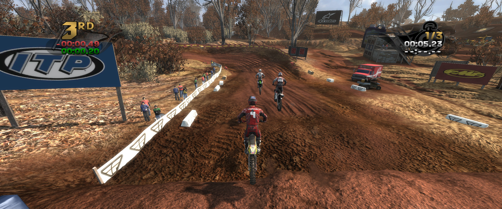
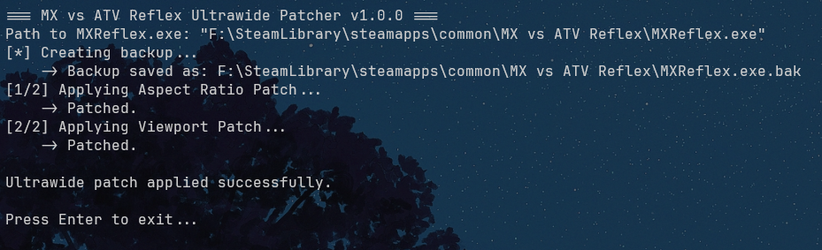

# mxvsatv-reflex-ultrawide-fix
Open Source Ultrawide Fix for MX vs ATV Reflex



<!-- HOW TO USE -->
# How to use
1. Download the latest release from the [releases page](https://github.com/Netaki/mxvsatv-reflex-ultrawide-fix/releases) or build from source.
2. Run the .exe file.
3. Paste the full path to the `MXReflex.exe` file into the console.
4. The patch will be applied automatically.\
   The tool also creates a backup of the original file under `MXReflex.exe.bak` if you want to revert the changes.



<!-- HOW TO BUILD -->
# How to build

### Prerequisites

1. Make sure that you have `cmake` installed on your system.
### Windows
  ```sh
  Get the latest version from https://cmake.org/download/
  ```

### Arch Linux
  ```sh
  sudo pacman -S cmake
  ```

2. Clone the repo
  ```sh
  git clone https://github.com/Netaki/mxvsatv-reflex-ultrawide-fix.git
  ```

# Building
### Windows
1. Setup cmake and build the project
   ```sh
   mkdir build
   cd build
   cmake .. -G "Visual Studio 17 2022" -DCMAKE_BUILD_TYPE=Release
   cmake --build . --config Release
   ```
2. Find the executable in `build/Release`
   ```sh
   ~/mxvsatv-reflex-ultrawide-fix/build/Release/MXvsATV-Reflex-Patcher-v1.0.0.exe
   ```
3. Start the .exe file and follow the instructions at [How to use](https://github.com/Netaki/mxvsatv-reflex-ultrawide-fix?tab=readme-ov-file#how-to-use)

### Linux
1. Setup cmake and build the project
    ```sh
   mkdir build
    cd build
    cmake .. -DCMAKE_BUILD_TYPE=Release
    make -j$(nproc)
    ```
2. Find the binary in `build/Release`
   ```sh
   ~/mxvsatv-reflex-ultrawide-fix/build/Release/MXvsATV-Reflex-Patcher-v1.0.0
   ```
3. TODO

<p align="right">(<a href="#readme-top">back to top</a>)</p>
